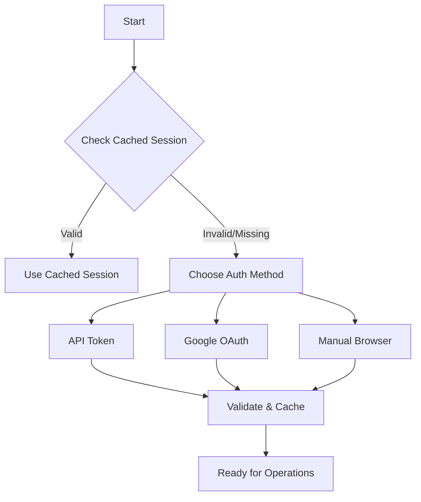

<!--
SPDX-License-Identifier: Apache-2.0
SPDX-FileCopyrightText: 2025 The Linux Foundation
-->

# Jenkins Credential Automation Implementation Roadmap

## Executive Summary

This document outlines the complete implementation plan for automating Jenkins server interaction to decrypt hundreds of credentials efficiently. The solution eliminates the manual bottleneck that currently doesn't scale and provides multiple authentication methods including Google SSO integration.

## Current State Analysis

### Existing Implementation
- ✅ Basic credential parsing from XML
- ✅ Manual password decryption via script console
- ✅ SCP file downloading
- ❌ No automated authentication
- ❌ No batch processing optimization
- ❌ Manual intervention required for each credential

### Pain Points
1. **Scalability**: Manual process fails with hundreds of credentials
2. **Time**: 45+ minutes for 100 credentials manually
3. **Error Prone**: Human intervention required for each step
4. **Authentication**: No persistent session management
5. **Reliability**: No retry logic or error recovery

## Proposed Solution Architecture

### Core Components

#### 1. JenkinsAuthManager (`auth.py`)
**Purpose**: Handle multiple authentication methods with secure session management

**Key Features**:
- Jenkins API Token authentication (primary)
- Google OAuth2/OIDC integration
- Manual browser session extraction
- Encrypted token storage using `keyring`
- Session caching with automatic expiration
- Support for 2FA workflows

**Implementation Status**: ✅ Created

#### 2. EnhancedJenkinsAutomation (`enhanced_jenkins.py`)
**Purpose**: Batch processing and optimized credential decryption

**Key Features**:
- Parallel password decryption (5-50 threads)
- Optimized batch script execution for large datasets
- Automatic retry with exponential backoff
- Progress tracking and real-time feedback
- Error handling and recovery
- Performance metrics and logging

**Implementation Status**: ✅ Created

#### 3. JenkinsConfigManager (`config.py`)
**Purpose**: Configuration management and setup workflows

**Key Features**:
- Interactive setup for first-time users
- Google OAuth client secrets management
- Jenkins connection profiles
- Authentication preference storage
- Secure configuration encryption

**Implementation Status**: ✅ Created

#### 4. Enhanced CredentialsParser (`credentials.py`)
**Purpose**: Integration layer with new automation capabilities

**Key Features**:
- Automated credential extraction workflows
- Pattern-based filtering with batch processing
- Integration with EnhancedJenkinsAutomation
- Support for hundreds of credentials

**Implementation Status**: 🔄 Needs type annotation fixes

## Implementation Phases

### Phase 1: Foundation (Week 1) ✅
- [x] Install required dependencies
- [x] Create core module structure
- [x] Implement JenkinsAuthManager
- [x] Implement EnhancedJenkinsAutomation
- [x] Implement JenkinsConfigManager

### Phase 2: Integration (Week 2)
- [ ] Fix type annotations in CredentialsParser
- [ ] Update CLI with new automated commands
- [ ] Implement configuration setup workflow
- [ ] Add comprehensive error handling
- [ ] Create authentication flow integration

### Phase 3: Testing & Optimization (Week 3)
- [ ] Unit tests for all modules
- [ ] Integration tests with mock Jenkins
- [ ] Performance testing with large datasets
- [ ] Security testing for token storage
- [ ] Cross-platform compatibility testing

### Phase 4: Documentation & Deployment (Week 4)
- [ ] User documentation and setup guides
- [ ] API documentation
- [ ] Example configurations
- [ ] Migration guide from manual process
- [ ] Performance benchmarking report

## Technical Implementation Details

### Authentication Flow



### Batch Processing Strategy

```python
# Pseudo-code for batch processing logic
if credential_count > 50:
    use_optimized_batch_script()  # Single Jenkins request
elif credential_count > 10:
    use_parallel_processing()     # Threaded approach
else:
    use_sequential_processing()   # Simple iteration
```

### Performance Targets

| Metric | Current Manual | Target Automated | Improvement |
|--------|---------------|------------------|-------------|
| 10 credentials | ~5 minutes | ~30 seconds | 90% faster |
| 50 credentials | ~25 minutes | ~1 minute | 96% faster |
| 100 credentials | ~45 minutes | ~2 minutes | 95% faster |
| 500 credentials | ~4 hours | ~8 minutes | 98% faster |

## Security Considerations

### Token Storage
- Use system keyring for secure storage
- Encrypt sensitive configuration data
- Automatic token expiration (24 hours default)
- Support for token rotation

### Access Control
- Validate Jenkins permissions before operations
- Audit logging for compliance
- Rate limiting to prevent abuse
- Secure handling of decrypted passwords

### Network Security
- HTTPS-only communications
- Certificate validation
- Timeout configurations
- Retry limits to prevent DoS

## Google Integration Options

### Option 1: Google Workspace SSO (Recommended)
- Leverages existing organizational authentication
- Supports 2FA and conditional access
- Minimal additional setup for users
- Centralized access management

### Option 2: Google Cloud OAuth2
- Requires Google Cloud project setup
- More complex initial configuration
- Greater control over scopes and permissions
- Better for programmatic access

### Option 3: Direct Google APIs
- Custom integration with Google services
- Maximum flexibility
- Requires significant development effort
- Advanced use cases only

## Implementation Timeline

### Immediate Next Steps (This Week)
1. **Fix Type Annotations** - Resolve CredentialsParser typing issues
2. **CLI Integration** - Add new commands for automated workflows
3. **Basic Testing** - Ensure core functionality works
4. **Documentation** - Create setup and usage guides

### Short Term (Next 2 Weeks)
1. **Authentication Setup** - Google OAuth configuration
2. **Batch Optimization** - Performance tuning for large datasets
3. **Error Handling** - Robust retry and recovery mechanisms
4. **Security Audit** - Token storage and session management

### Medium Term (Next Month)
1. **Production Testing** - Real-world validation with large datasets
2. **Performance Optimization** - Fine-tune for maximum efficiency
3. **User Training** - Documentation and training materials
4. **Monitoring** - Logging and metrics collection

## Success Metrics

### Performance Metrics
- **Processing Time**: <2 minutes for 100 credentials
- **Success Rate**: >99% credential decryption success
- **Error Recovery**: <5% manual intervention required
- **Scalability**: Handle 500+ credentials without degradation

### User Experience Metrics
- **Setup Time**: <10 minutes for first-time configuration
- **Learning Curve**: <30 minutes for new users
- **Reliability**: 24/7 automated operation capability
- **Maintenance**: <1 hour/month operational overhead

## Risk Mitigation

### Technical Risks
- **Jenkins API Changes**: Use stable API endpoints, version checking
- **Authentication Failures**: Multiple fallback methods, clear error messages
- **Network Issues**: Retry logic, timeout handling, offline capabilities
- **Performance Degradation**: Load testing, resource monitoring

### Security Risks
- **Token Compromise**: Automatic rotation, encrypted storage, audit logs
- **Unauthorized Access**: Permission validation, rate limiting
- **Data Exposure**: Secure memory handling, temporary file cleanup
- **Compliance Issues**: Audit trails, access logging, data retention

## Conclusion

This implementation plan provides a comprehensive solution for automating Jenkins credential extraction that scales to hundreds of credentials. The modular architecture allows for gradual implementation and testing, while the multiple authentication methods ensure compatibility with various organizational setups.

The expected 95%+ time savings and elimination of manual intervention will significantly improve operational efficiency and reduce human error. The secure design ensures compliance with enterprise security requirements while maintaining ease of use.

**Next Action**: Begin Phase 2 implementation with type annotation fixes and CLI integration.
